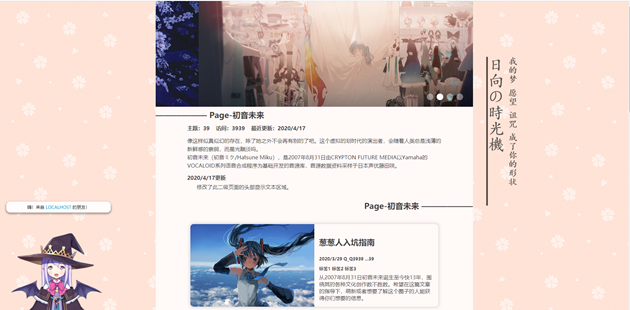

# 说明文档

---

这是我学习 HTML/CSS/JS 时，做的个人网站页面，只做了纯前端部分。请下载整个 Source 文件夹后浏览。

完成度较低，部分页面之间还未做好页面跳转，请逐个点击源码文件夹下的 .html 文件浏览页面。

此外请注意：

1. 为了避免页面组件缺失，如有可能请使用 WebStrom 以项目方式打开此项目
2. 没有考虑太多的兼容性问题，建议使用 chrome 浏览器
3. 请从 index.html 页面开始浏览
3. 导航栏中的大部分结构相似的二/三级页面没有实现

本项目是以学习为目的开发的，没有使用框架，所有的布局、动画都是从零实现。

本网站是个人项目，所以包含了强烈的个人色彩，请不要太在意网站里的动漫图片和文本内容。

另：由于本人未知的原因，我在本网站中加入了 Liver2D 看板娘组件，但在未部署网站时，以本地文件打开本网站的 .html 文件时，不会显示看板娘。如果使用 WebStorm 打开本地 .html 文件，则可正常显示。正常显示的看板娘在网页左下角，可互动，效果如下：

